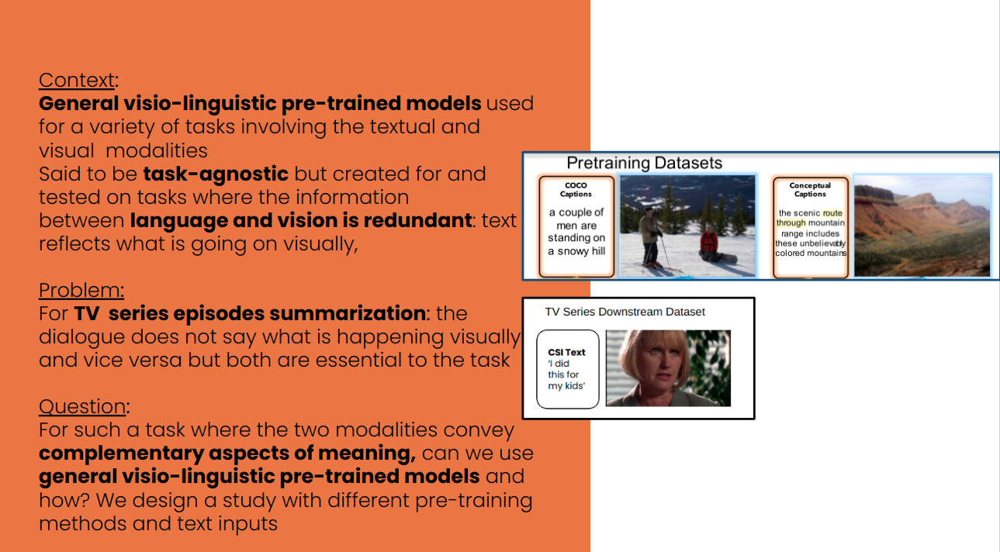
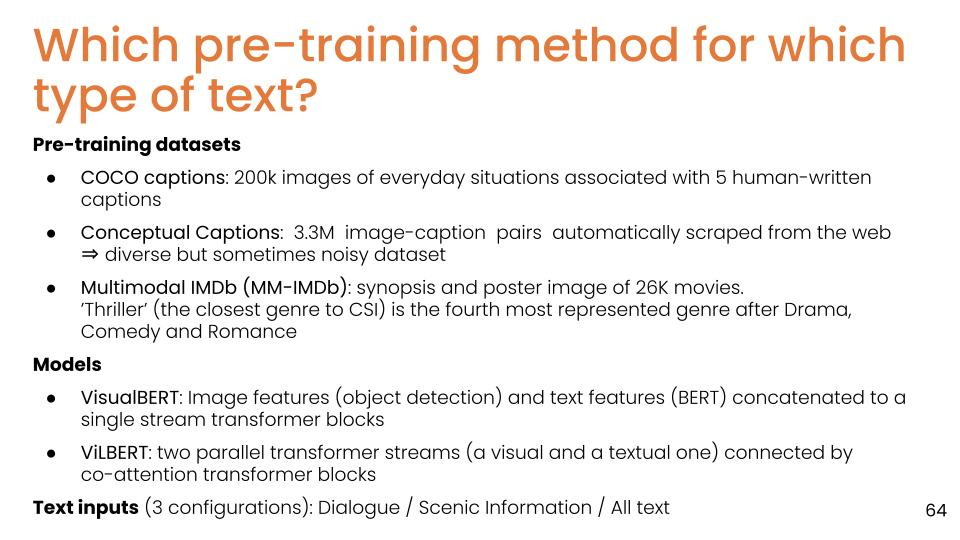
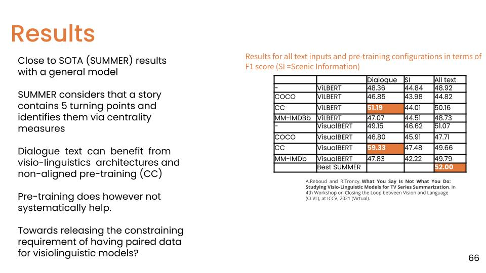

The results computed in this repository were published in 
```bibtex
@inproceedings{reboud2021you,
  title={What You Say Is Not What You Do: Studying Visio-Linguistic Models for TV Series Summarization},
  author={Reboud, Alison and Troncy, Rapha{\"e}l},
  booktitle={Proceedings of the IEEE/CVF International Conference on Computer Vision},
  pages={3149--3153},
  year={2021}
}
```
## Why this study?

## The study

The script for each of the pretraining/mode/text input combinations is available as shell scripts in the [`commands`] folder (./commands/)
## Results

## Installation

Follow installation instructions in the [documentation](https://mmf.sh/docs/getting_started/installation).
This repo is based on MMF, a modular framework for vision and language multimodal research from Facebook AI Research. 


If you use MMF in your work or use any models published in MMF, please cite:

```bibtex
@misc{singh2020mmf,
  author =       {Singh, Amanpreet and Goswami, Vedanuj and Natarajan, Vivek and Jiang, Yu and Chen, Xinlei and Shah, Meet and
                 Rohrbach, Marcus and Batra, Dhruv and Parikh, Devi},
  title =        {MMF: A multimodal framework for vision and language research},
  howpublished = {\url{https://github.com/facebookresearch/mmf}},
  year =         {2020}
}
```


## Documentation

Learn more about MMF [here](https://mmf.sh/docs).


## License

MMF is licensed under BSD license available in [LICENSE](LICENSE) file
